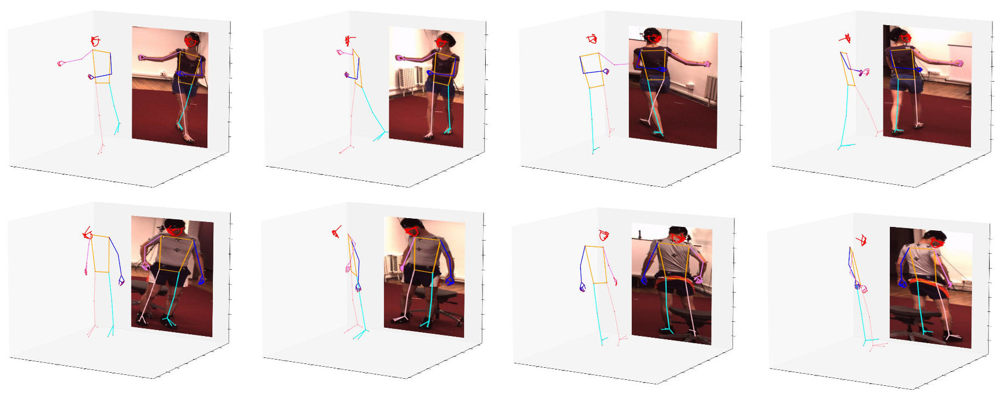

# H3WB: Human3.6M 3D WholeBody Dataset and Benchmark

This is the official repository for the paper ["H3WB: Human3.6M 3D WholeBody Dataset and Benchmark"](https://arxiv.org/abs/2211.15692) (ICCV'23). The repo contains Human3.6M 3D WholeBody (H3WB) annotations proposed in this paper.

For the 3D whole-body benchmark and results please refer to [benchmark.md](benchmark.md).

## Table of Content
- [About H3WB](#what-is-h3wb)
- [Dataset](#h3wb-dataset)
- [Pretrained models](#pretrained-models)
- [Tasks](#tasks)
- [Evaluation](#evaluation)
- [How to cite](#how-to-cite)

## What is H3WB

H3WB is a large-scale dataset for 3D whole-body pose estimation. It is an extension of [Human3.6m dataset](http://vision.imar.ro/human3.6m/) and 
contains 133 whole-body (17 for body, 6 for feet, 68 for face and 42 for hands) keypoint annotations on 100K images. The skeleton layout is the same as 
[COCO-Wholebody dataset](https://github.com/jin-s13/COCO-WholeBody). Extensions to other popular 3D pose estimation datasets are ongoing and we already 
have annotations for [Total Capture](http://www.cs.cmu.edu/~hanbyulj/totalcapture/). If you want your favorite multi-view dataset to get whole-body 3D 
annotations, let us know!

Example annotations:



Layout from COCO-WholeBody: [Image source](https://github.com/jin-s13/COCO-WholeBody).


## H3WB Dataset

### Download

Images can be downloaded from the official cite of [Human3.6m dataset](http://vision.imar.ro/human3.6m/).
We provide a data preparation [script](datasets/data_preparation.py) to compile Human3.6m videos into images which allows establishing correct correspondence between images and annotations.

The annotations for H3WB can be downloaded from [here](https://drive.google.com/file/d/1WVscFZcFIxGi_doifFP3GLTsIbU-hjXO/view?usp=sharing) and by default it is put under [datasets/json/](datasets/json/).

The annotations for T3WB can be downloaded from [here](https://drive.google.com/file/d/155DpAJZ4XY6Mov9pmhrGzRG4PywDlZv2/view?usp=share_link).

### Annotation format
Every json is in the following structure, but not every json contains all these values. See [Tasks](#Tasks) section.
```
XXX.json --- sample id --- 'image_path'
                        |
                        -- 'bbox' --- 'x_min'
                        |          |- 'y_min'
                        |          |- 'x_max'
                        |          |- 'y_max'
                        |
                        |- 'keypont_2d' --- joint id --- 'x'
                        |                             |- 'y'
                        |
                        |- 'keypont_3d' --- joint id --- 'x'
                                                      |- 'y'
                                                      |- 'z'
                        
                        
```
We also provide a [script](utils/utils.py) to load json files.

## Pretrained models

H3WB comes with pretrained models that were used to create the datasets. Model implementations can be found in the 'models/' folder. Please find chekpoints in the table below:

| Dataset | Completion | Diffusion Hands | Diffusion Face |
|---------|------------|-----------------|----------------|
|  H3WB   | [ckpt](https://drive.google.com/file/d/1eJ-uz6RYtg3emGiu8IAY72UsUbpTVzzK/view?usp=share_link) | [ckpt](https://drive.google.com/file/d/1G17FaOqd5GlSm08wxMaxjwMmRSqgwXeF/view?usp=share_link) | [ckpt](https://drive.google.com/file/d/15ZUUZSqKGzVCNYRo4-PYqfsso7ajIb07/view?usp=share_link) |

Pretrained models for the different tasks of the benchmark can be found in [benchmark.md](benchmark.md).


## Tasks

We propose 3 different tasks along with the 3D WholeBody dataset:

#### 2D &rarr; 3D: 2D complete whole-body to 3D complete whole-body lifting

 - Use 2Dto3D_train.json for training and validation. It contains 80k 2D and 3D keypoints.

 - Use 2Dto3D_test_2d.json for test on leaderboard. It contains 10k 2D keypoints.

#### I2D &rarr; 3D: 2D incomplete whole-body to 3D complete whole-body lifting

 - Use 2Dto3D_train.json for training and validation. It contains 80k 2D and 3D keypoints.
 - Please apply masking on yourself during the training. The official masking strategy is as follows:
    - With 40\% probability, each keypoint has a 25\% chance of being masked,
    - with 20\% probability, the face is entirely masked,
    - with 20\% probability, the left hand is entirely masked,
    - with 20\% probability, the right hand is entirely masked.

 - Use I2Dto3D_test_2d.json for test on leaderboard. It contains 10k 2D keypoints. Note that this test set is different from the 2Dto3D_test_2d.json.

#### RGB &rarr; 3D: Image to 3D complete whole-body prediction

 - Use RGBto3D_train.json for training and validation. It contains 80k image_path, bounding box and 2D keypoints.
 - It has the same samples from the 2Dto3D_train.json, so you can also access to 2D keypoints if needed.
 - Use RGBto3D_test_img.json for test on leaderboard. It contains 20k image_path and bounding box. 
 - Note that the test sample ids are not aligned with previous 2 tasks.

## Evaluation

### Validation
We do not provide a validation set. We encourage researchers to report 5-fold cross-validation results with average and standard deviation values.

### Evaluation on test set
Please save your 3D whole-body predictions on test set into 'XXto3D_pred.json', and send a downloadable link for the json file to [wholebody3d@gmail.com with subject Test set evaluation request](mailto:wholebody3d@gmail.com?subject=Test%20set%20evaluation%20request). An example file to upload for the test set predictions can be found [here](https://drive.google.com/file/d/10GqGJaNgrz1cTjrz4CpKqpeFF0LJBVDA/view?usp=sharing).

### Visualization
We provide a [function](utils/utils.py) to visualize 3D whole-body, as well as the evaluation function for the leaderboard in  this [script](test_leaderboard.py). 

## Benchmark

Please refer to [benchmark.md](benchmark.md) for the benchmark results.

## Terms of Use

1. This project is released under the [MIT License](https://github.com/wholebody3d/wholebody3d/blob/main/LICENSE.md). 

2. We do not own the copyright of the images. Use of the images must abide by the [Human3.6m License agreement](http://vision.imar.ro/human3.6m/eula.php).


## How to cite

If you find H3WB 3D WholeBody dataset useful for your project, please cite our paper as follows.

> Yue Zhu, Nermin Samet, David Picard, "H3WB: Human3.6M 3D WholeBody Dataset and benchmark", ICCV, 2023.

BibTeX entry:
```
@InProceedings{Zhu_2023_ICCV,
    author    = {Zhu, Yue and Samet, Nermin and Picard, David},
    title     = {H3WB: Human3.6M 3D WholeBody Dataset and Benchmark},
    booktitle = {Proceedings of the IEEE/CVF International Conference on Computer Vision (ICCV)},
    month     = {October},
    year      = {2023},
    pages     = {20166-20177}
}
```

Please also consider citing the following works.

```
@article{h36m_pami,
 author = {Ionescu, Catalin and Papava, Dragos and Olaru, Vlad and Sminchisescu, Cristian},
 title = {Human3.6M: Large Scale Datasets and Predictive Methods for 3D Human Sensing in Natural Environments},
 journal = {IEEE Transactions on Pattern Analysis and Machine Intelligence},
 publisher = {IEEE Computer Society},
 year = {2014}
} 
 
@inproceedings{IonescuSminchisescu11,
 author = {Catalin Ionescu, Fuxin Li, Cristian Sminchisescu},
 title = {Latent Structured Models for Human Pose Estimation},
 booktitle = {International Conference on Computer Vision},
 year = {2011}
}
```

